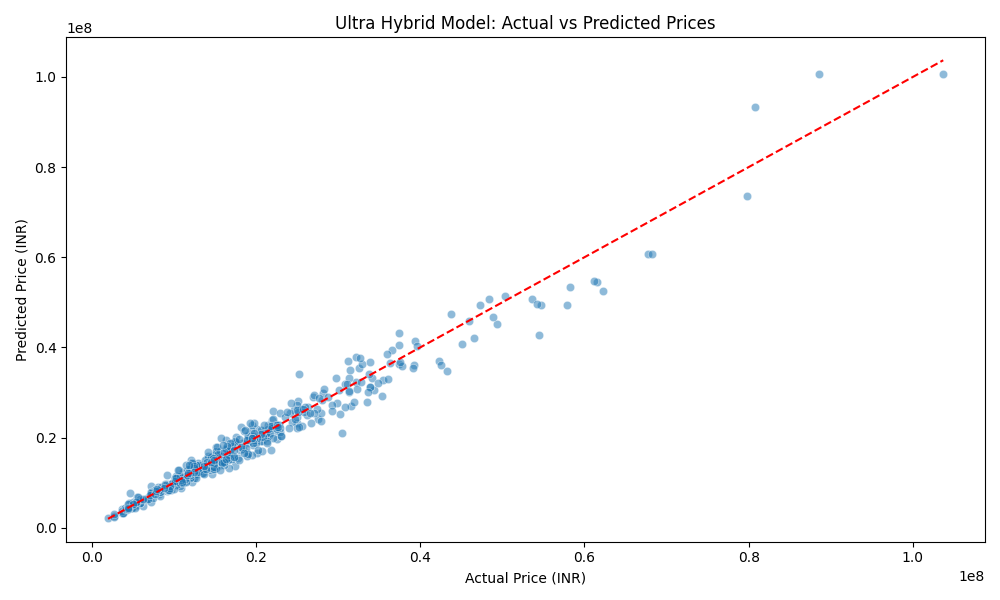
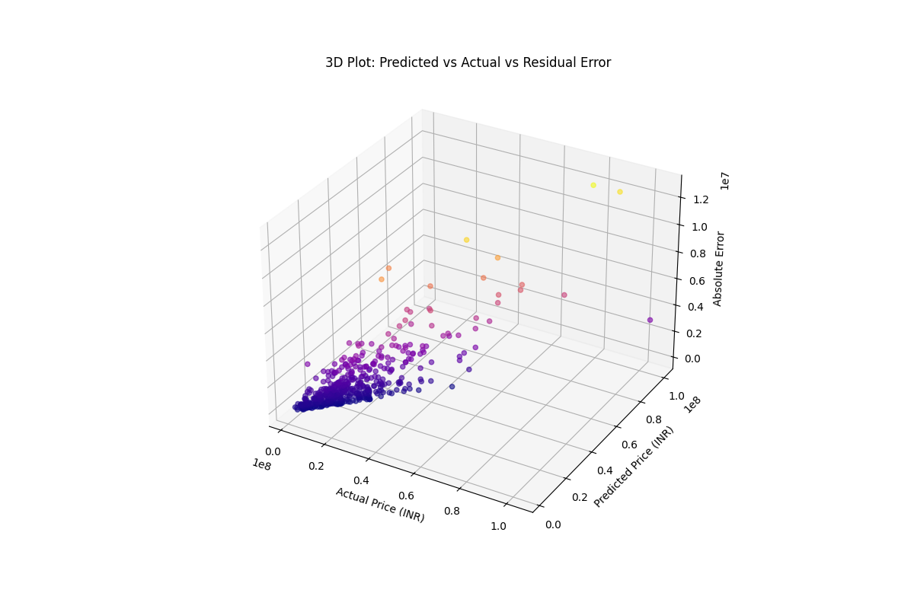
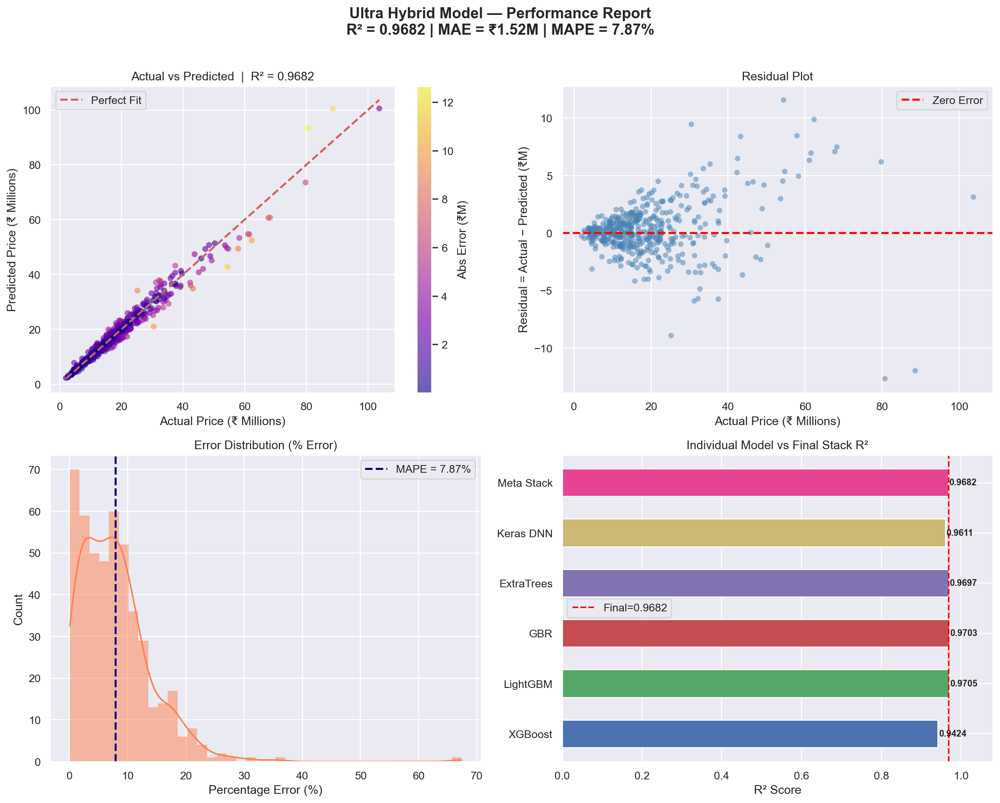
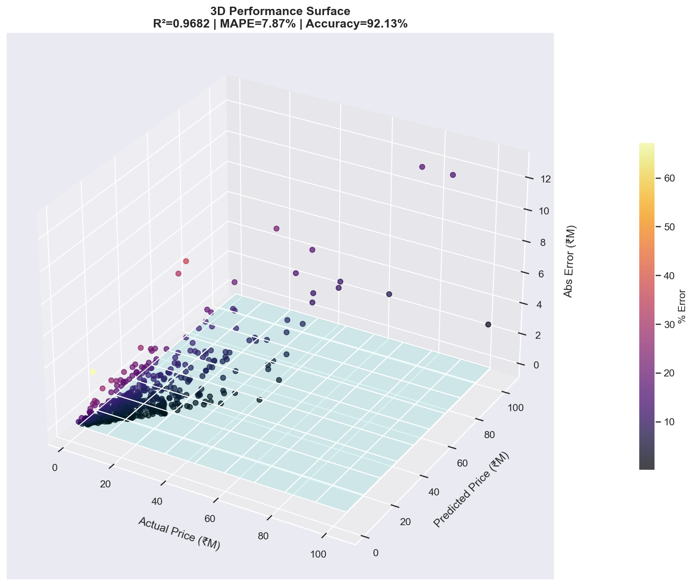
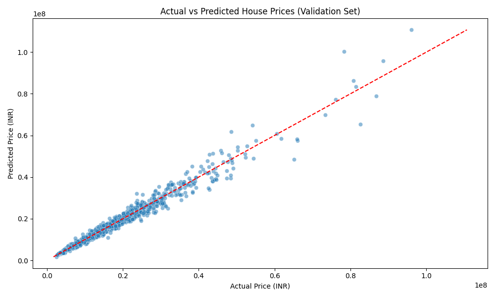
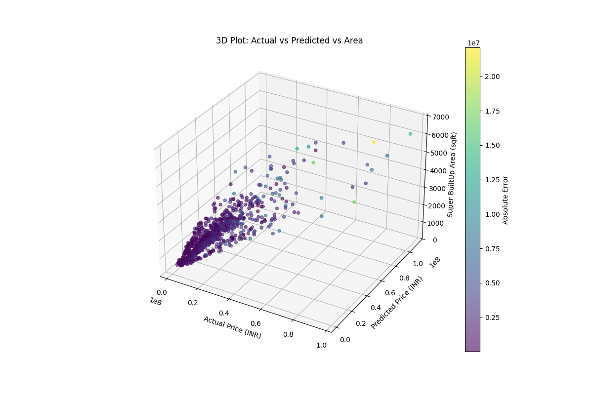

# 🏠 House Price Prediction — Ultra Hybrid ML Pipeline

> An **industry-level** house price prediction system for the Indian real estate market, combining **5 powerful models** into a stacking ensemble with an XGBoost meta-learner.

---

## 🧠 Model Architecture

```
┌──────────────────────────────────────────────────────────────┐
│                    INPUT (Property Features)                 │
│   City, BHK, Area, Floor, Furnishing, Amenities, Age, etc.  │
└──────────────┬───────────────────────────────┬───────────────┘
               │                               │
       ┌───────▼───────┐               ┌───────▼───────┐
       │  Numeric       │               │  Categorical   │
       │  Pipeline      │               │  Pipeline      │
       │  (Impute+Scale)│               │  (TargetEncode)│
       └───────┬───────┘               └───────┬───────┘
               └───────────────┬───────────────┘
                               │
               ┌───────────────▼───────────────┐
               │     PREPROCESSED FEATURES      │
               └───┬───┬───┬───┬───────────┬───┘
                   │   │   │   │           │
              ┌────▼┐ ┌▼──┐│  ┌▼────┐  ┌───▼──────────┐
              │ XGB ││ LGB││  │ GBR │  │ Transformer + │
              │     ││    ││  │     │  │ ResNet DNN    │
              └──┬──┘└─┬──┘│  └──┬──┘  └──────┬───────┘
                 │     │   │     │             │
                 │     │ ┌─▼──┐  │             │
                 │     │ │ ET │  │             │
                 │     │ └─┬──┘  │             │
                 │     │   │     │             │
               ┌─▼─────▼───▼─────▼─────────────▼─┐
               │    STACKED PREDICTIONS (5 cols)   │
               └───────────────┬──────────────────┘
                               │
                    ┌──────────▼──────────┐
                    │  XGBoost Meta-Learner│
                    │  (500 estimators)    │
                    └──────────┬──────────┘
                               │
                    ┌──────────▼──────────┐
                    │   FINAL PREDICTION   │
                    │    (Price in INR)     │
                    └─────────────────────┘
```

| Layer | Models | Details |
|-------|--------|---------|
| **Base Learners** | XGBoost, LightGBM, GBR, ExtraTrees, Transformer+ResNet DNN | Optuna-tuned hyperparameters |
| **Meta Learner** | XGBoost | Trained on stacked base predictions |
| **Tuning** | Optuna | 30 trials × 3-Fold CV per model |
| **DNN** | Transformer + ResNet Hybrid | Self-attention + residual dense layers |

---

## 📊 Performance Results

### Actual vs Predicted Prices
<p align="center">
  
</p>

### 3D Residual Analysis
<p align="center">
  
</p>

### Full Performance Dashboard
<p align="center">
  
</p>

> The dashboard includes: Actual vs Predicted scatter, Residual plot, Error distribution, and per-model R² comparison.

### 3D Performance Surface
<p align="center">
  
</p>

### Additional Visualizations
<p align="center">
  
  
</p>

---

## 📁 Project Structure

```
├── House_Price_Training.ipynb        # Full training pipeline notebook
├── House_Price_Evaluation.ipynb      # Evaluation & visualization notebook
├── app.py                            # Flask web app for live predictions
├── trainme.py                        # Training script (standalone)
├── evaluate.py                       # Evaluation script (standalone)
├── templates/
│   └── index.html                    # Web UI for the predictor
├── static/                           # Static assets (CSS, JS)
├── requirements.txt                  # Python dependencies
├── PanTrainModel_data1/              # Training & test CSV datasets
├── performance_dashboard.png         # 2D evaluation dashboard
├── performance_3d.png                # 3D performance surface plot
├── hybrid_actual_vs_predicted.png    # Scatter plot (actual vs predicted)
├── hybrid_3d_residuals.png           # 3D residual analysis
├── actual_vs_predicted.png           # Additional scatter plot
├── actual_vs_predicted_3d.png        # Additional 3D scatter
└── test_predictions.csv              # Predictions on unseen test data
```

---

## 🚀 Quick Start

### 1. Clone the Repository
```bash
git clone https://github.com/AshiteshSingh/House-price-prediction.git
cd House-price-prediction
```

### 2. Install Dependencies
```bash
pip install -r requirements.txt
```

### 3. Train the Model
Open and run **`House_Price_Training.ipynb`** in Jupyter Notebook or VS Code. Training includes:
- Optuna hyperparameter search (30 trials per model)
- Sequential incremental training across multiple dataset chunks
- 2000-epoch Transformer DNN with early stopping

### 4. Evaluate
Open and run **`House_Price_Evaluation.ipynb`** to generate performance dashboards.

### 5. Run the Web App
```bash
python app.py
```
Then open [http://127.0.0.1:5000](http://127.0.0.1:5000) to get real-time predictions.

---

## 🌐 Web App Features

- Beautiful dark-mode UI with glassmorphism design
- Supports **8 major Indian cities**: Mumbai, Delhi NCR, Bengaluru, Chennai, Hyderabad, Pune, Kolkata, Ahmedabad
- Real-time predictions in under 1 second
- Displays price in ₹ Crores, Lakhs, and per sqft

---

## 🛠️ Tech Stack

| Category | Technologies |
|----------|-------------|
| **ML Models** | XGBoost, LightGBM, Scikit-learn (GBR, ExtraTrees) |
| **Deep Learning** | TensorFlow/Keras (Transformer + ResNet hybrid) |
| **Hyperparameter Tuning** | Optuna (Bayesian optimization) |
| **Web Framework** | Flask |
| **Visualization** | Matplotlib, Seaborn |
| **Data Processing** | Pandas, NumPy |

---

## 📈 Training Pipeline

| Phase | Description |
|-------|-------------|
| **Phase 1** | Optuna hyperparameter tuning — 30 trials × 3-fold CV for XGBoost & LightGBM |
| **Phase 2** | Initialize all 5 base learners with optimized parameters |
| **Phase 3** | Sequential incremental training across dataset chunks |
| **Phase 4** | Train XGBoost meta-learner on stacked base predictions |
| **Phase 5** | Validation metrics (R², MAE, RMSE) |
| **Phase 6** | Generate 2D and 3D visualizations |
| **Phase 7** | Save all models (`.pkl` + `.keras`) |
| **Phase 8** | Generate predictions on unseen test data |

---

<p align="center">
  <b>Made with ❤️ by Ashitesh</b>
</p>
